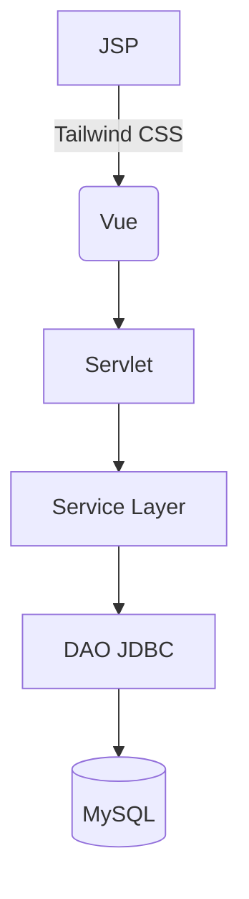

[](https://opensource.org/licenses/MIT)


# 🏡 ReserveMate - La nouvelle génération de réservation d'hébergements

**Plateforme communautaire développée en Java EE avec architecture MVC**  
*Conçue pour les voyageurs en quête d'authenticité et les hôtes exigeants*


## 🌟 Ce qui nous distingue

### Pour les voyageurs
- 🔍 **Moteur de recherche intelligent** (JSP + Servlets)
- 📅 **Calendrier de disponibilité** (JDBC optimisé)
- 🏷 **Système de tags avancé** (Modèle Java EE)


### Pour les hôtes
- 📊 **Dashboard MVC complet** (Servlet Controller)
- 📈 **Analytics temps réel** (JDBC + MySQL Procedures)


## 🛠 Stack Technique



**Notre architecture MVC robuste :**
- **Modèle** : Beans Java + DAO JDBC haute performance
- **Vue** : JSP dynamiques avec Tailwind CSS pour un design responsive
- **Contrôleur** : Servlets optimisés avec routage intelligent

**Points forts techniques :**
- Pool de connexions JDBC configuré pour haute disponibilité
- Transactions ACID pour la gestion des réservations
- Système de cache applicatif (Level 2)
- Templates JSP modulaires

## 🚀 Déploiement

1. **Prérequis :**
   ```bash
   Java EE 8+
   Tomcat 9+
   MySQL 5.7+
   ```

2. **Installation :**
   ```bash
   git clone https://github.com/hamza-240/ReserveMate.git
   mvn clean package
   ```
